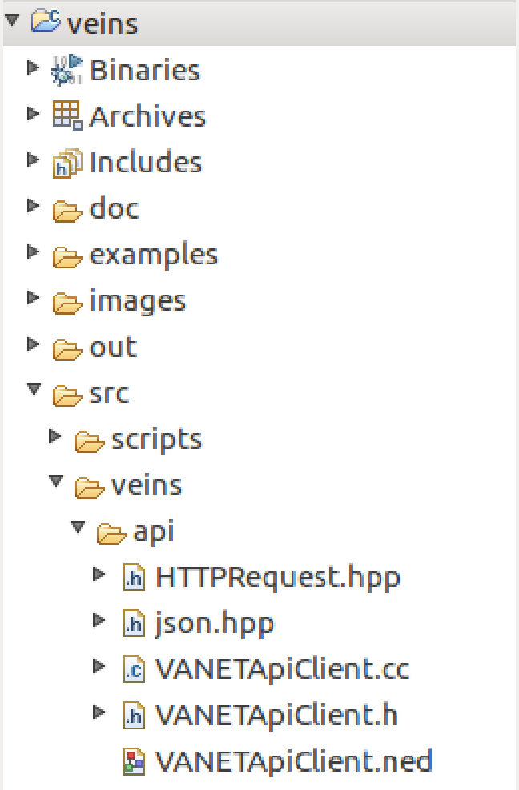

# VANET-Client
A client app to upload simulation data to our VANET server for further data analysis
## Table of Contents
**[Dependencies to install](#Dependencies-to-install)** <br>
**[Client side source code](#Client-side-source-code)** <br>

## Dependencies to install
**List of dependencies to install**

## Client side source code
**First thing is to add the api directory under ```veins/src/veins/``` so that it looks like:**



