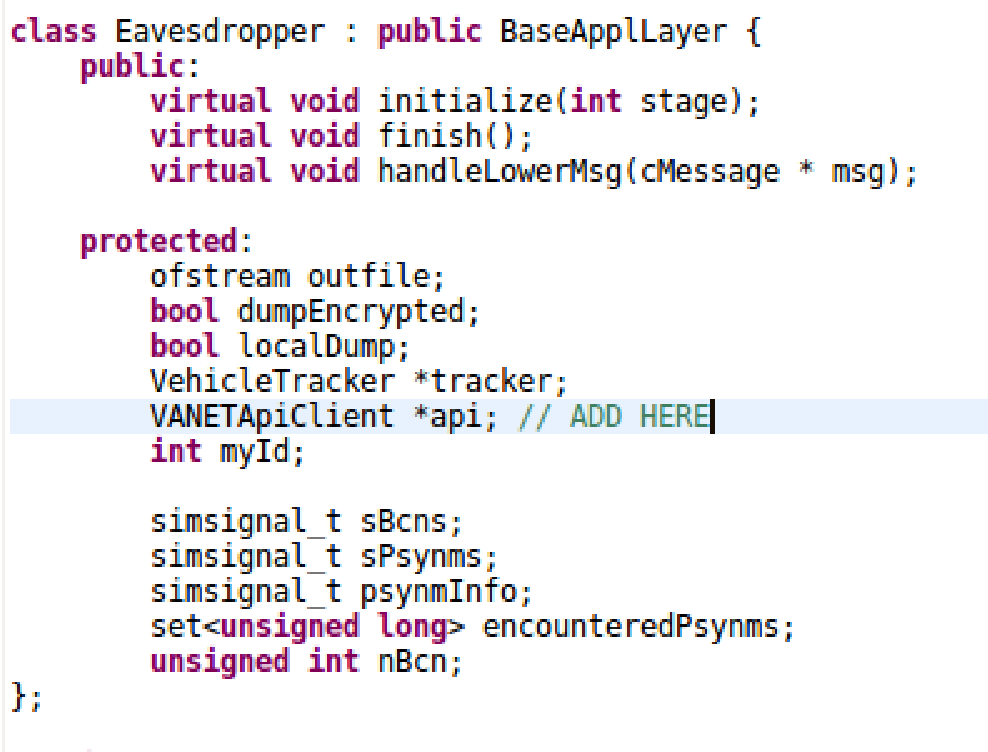
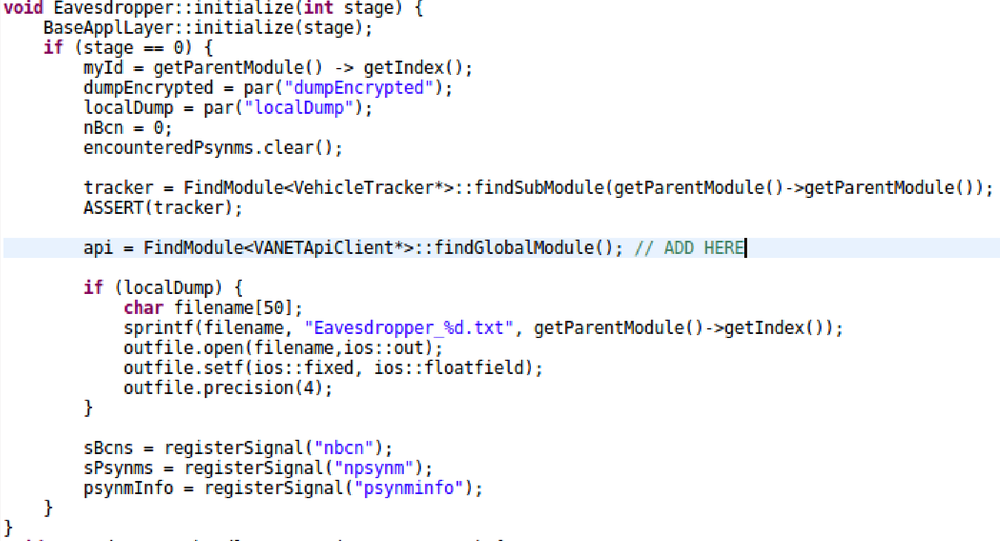
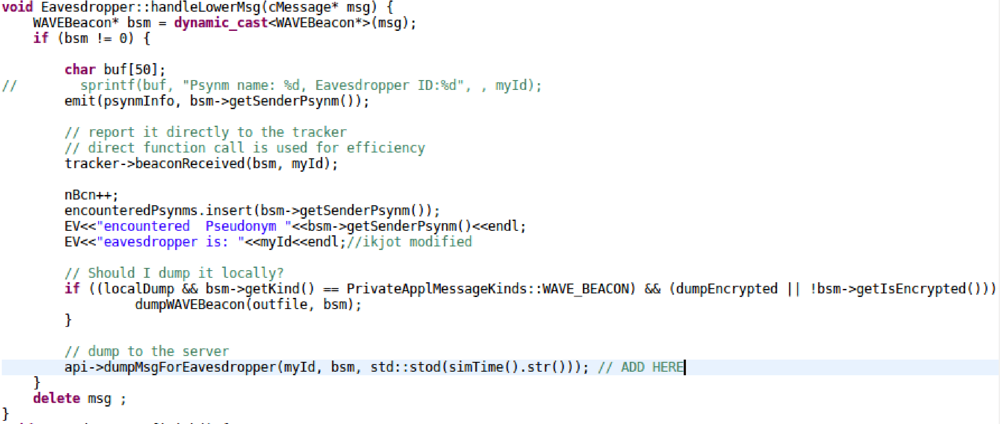

# VANET-Client
A client app to upload simulation data to our VANET server for further data analysis
## Table of Contents

## Adding the source code to VANET and VEINS
**1. Add the `api` directory under ```veins/src/veins/``` so that it looks like:** <br/><br/>
 <br/><br/>
**2. Add this import line in the Eavesdropper.h file** <br/><br/>
``` #include "veins/api/VANETApiClient.h" ``` <br/><br/>
**3. Add this decloration of the object under the protected class parameters in the Eavesdropper.h file** <br/><br/>
`` VANETApiClient *api; `` <br/><br/>
 <br/><br/>
**4. Add this intitialization of the client in the `initialize` function in the Eavesdropper.cc file** <br/><br/>
`api = FindModule<VANETApiClient*>::findGlobalModule();` <br/><br/>
 <br/><br/>
**5. Add this function call line in the `handleLowerMsg` function in the Eavesdropper.cc file** <br/><br/>
`api->dumpMsgForEavesdropper(myId, bsm, std::stod(simTime().str()));` <br/><br/>
 <br/><br/>
