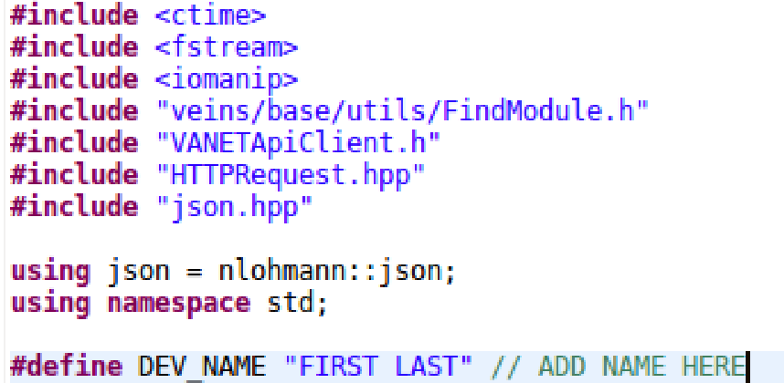

# VANET-Client
A client app to upload simulation data to our VANET server for further data analysis
## Table of Contents

**[Adding the source code to VANET and VEINS](#Adding-the-source-code-to-VANET-and-VEINS)** <br>
**[Contributing](#Contributing)** <br>

## Adding the source code to VANET and VEINS
**1. Add the `api` directory under ```veins/src/veins/``` so that it looks like:** <br/><br/>
 <br/><br/>
**2. Add your name to the `DEV_NAME` macro at the near top of the VANETApiClient.cc file** <br/><br/>
 <br/><br/>
**3. Add this import line in the Eavesdropper.h file** <br/><br/>
``` #include "veins/api/VANETApiClient.h" ``` <br/><br/>
**4. Add this decloration of the object under the protected class parameters in the Eavesdropper.h file** <br/><br/>
`` VANETApiClient *api; `` <br/><br/>
 <br/><br/>
**5. Add this intitialization of the client in the `initialize` function in the Eavesdropper.cc file** <br/><br/>
`api = FindModule<VANETApiClient*>::findGlobalModule();` <br/><br/>
 <br/><br/>
**6. Add this function call line in the `handleLowerMsg` function in the Eavesdropper.cc file** <br/><br/>
`api->dumpMsgForEavesdropper(myId, bsm, std::stod(simTime().str()));` <br/><br/>
 <br/><br/>
**7. Now everytime a simulation is ran, all the data will be sent to the server** <br/><br/>

## Contributing
** Currently, this client app only dumps simulation data about:
- Privacy scheme
- The developer running the simulation
- Date and time of simulation
- Eavesdroppers and all the psynms they have captured

If you want to add more data to the simulation then feel free to do so, just make a pull request and make sure you add the documentation needed to add the new source code to this README
 
**
